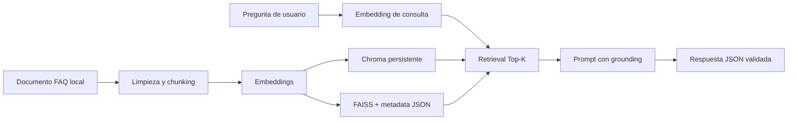

# PeopleFlow FAQ RAG — Proyecto integrador AEM2

Este proyecto integra embeddings, fragmentación de texto, búsqueda vectorial y generación fundamentada en un asistente de preguntas frecuentes para **PeopleFlow**, una plataforma ficticia de Recursos Humanos.

La meta no es solamente obtener una respuesta: es poder explicar **qué evidencia la sustenta**, comparar dos backends de búsqueda y detectar cuándo el sistema debe abstenerse.

## Qué entrega el proyecto

Al finalizar, el asistente debe:

- Indexar un documento local de políticas de PeopleFlow en chunks trazables.
- Recuperar los fragmentos más relevantes para una consulta.
- Usar el mismo embedding para documentos y preguntas.
- Comparar Chroma persistente con FAISS + metadata JSON.
- Generar una respuesta que use únicamente el contexto recuperado.
- Indicar explícitamente que no cuenta con evidencia suficiente cuando corresponda.
- Devolver un JSON con exactamente tres claves públicas.
- Medir calidad de retrieval y rendimiento de ambos backends.

## Recorrido recomendado

1. Leé y ejecutá la [clase teórico-práctica](notebooks/00_clase_teoria_y_practica_proyecto_rag.ipynb).
2. Recorré los cuatro laboratorios de `notebooks/` en orden.
3. Generá o inspeccioná el documento base en `data/`.
4. Indexá el mismo corpus con los dos backends.
5. Hacé consultas, inspeccioná los chunks relacionados y probá una pregunta sin evidencia.
6. Corré la evaluación, el benchmark y las pruebas automatizadas.
7. Documentá una decisión técnica usando los resultados.

## Arquitectura



Hay dos etapas separadas:

| Etapa | Qué hace | Archivos principales |
| --- | --- | --- |
| Ingesta | Limpia el documento, crea chunks, calcula embeddings e indexa. | `src/generate_data.py`, `src/chunking.py`, `src/embeddings.py`, `src/index.py` |
| Consulta | Embebe la pregunta, recupera contexto, aplica grounding y valida la salida. | `src/query.py`, `src/models.py`, `src/stores.py` |

## Estructura del proyecto

```text
proyecto_integrador/
├── data/
│   ├── faq_document.txt        # Fuente local de las políticas de PeopleFlow
│   └── golden_cases.json       # Consultas y chunks esperados para evaluar retrieval
├── notebooks/
│   ├── 00_clase_teoria_y_practica_proyecto_rag.ipynb
│   ├── PIM_E01_arquitectura_y_contrato.ipynb
│   ├── PIM_E02_documento_chunking_indexacion.ipynb
│   ├── PIM_E03_retrieval_grounding_json.ipynb
│   └── PIM_E04_evaluacion_benchmark_defensa.ipynb
├── outputs/                    # Resultados locales; no se versionan
├── src/
│   ├── config.py               # Variables, modelos, rutas y defaults
│   ├── models.py               # Modelos y contrato Pydantic
│   ├── chunking.py             # Limpieza y fragmentación trazable
│   ├── embeddings.py           # Adaptadores reales y falsos de embeddings
│   ├── stores.py               # Interfaz + backends Chroma y FAISS
│   ├── index.py                # Construcción y carga de índices
│   ├── query.py                # Retrieval, grounding y respuesta
│   ├── evaluate.py             # Golden cases y Recall@K
│   └── benchmark.py            # Comparación de rendimiento
├── tests/                      # Pruebas sin consumo de API
├── .env.example
├── requirements.txt
└── README.md
```

## Contrato público de la respuesta

La aplicación expone solamente estas tres claves. No agregues campos adicionales a la salida pública.

```json
{
  "user_question": "¿Cómo restablezco mi contraseña?",
  "system_answer": "Para restablecer tu contraseña, seguí el procedimiento indicado en el portal de PeopleFlow...",
  "chunks_related": ["chunk_003", "chunk_004"]
}
```

| Clave | Tipo | Propósito |
| --- | --- | --- |
| `user_question` | string | Pregunta original de la persona usuaria. |
| `system_answer` | string | Respuesta fundamentada exclusivamente en los chunks recuperados. |
| `chunks_related` | lista de strings | Identificadores de 2 a 5 chunks usados como evidencia. |

Si la evidencia no alcanza, `system_answer` debe expresarlo claramente. Una respuesta que inventa una política o un procedimiento es incorrecta, aun si parece convincente.

## Requisitos e instalación

Requiere Python 3.10 o posterior. Desde esta carpeta:

```powershell
python -m venv .venv
.\.venv\Scripts\Activate.ps1
pip install -r requirements.txt
Copy-Item .env.example .env
```

Abrí `.env` y completá `OPENAI_API_KEY` solo si vas a ejecutar embeddings y generación reales. Nunca compartas ni subas este archivo.

```dotenv
OPENAI_API_KEY=
AEM2_EMBEDDING_MODEL=text-embedding-3-small
AEM2_GENERATION_MODEL=gpt-5.6-luna
AEM2_CHUNK_SIZE=120
AEM2_CHUNK_OVERLAP=24
AEM2_TOP_K=4
```

| Variable | Default | Efecto |
| --- | --- | --- |
| `AEM2_EMBEDDING_MODEL` | `text-embedding-3-small` | Modelo usado para corpus y consultas. |
| `AEM2_GENERATION_MODEL` | `gpt-5.6-luna` | Modelo usado para responder con grounding. |
| `AEM2_CHUNK_SIZE` | `120` | Tamaño objetivo del fragmento. |
| `AEM2_CHUNK_OVERLAP` | `24` | Cantidad de palabras compartidas entre chunks. |
| `AEM2_TOP_K` | `4` | Cantidad de fragmentos recuperados por defecto. |

Las actividades conceptuales y las pruebas unitarias pueden ejecutarse sin clave: utilizan datos y adaptadores deterministas. Las llamadas reales a la API pueden generar costos según el uso y precios vigentes.

## Ejecución paso a paso

### 1. Preparar el documento de trabajo

El corpus se encuentra en `data/faq_document.txt`. Debe tener más de 1.000 palabras y producir al menos 20 chunks de tamaño razonable. Para regenerar los datos de ejemplo:

```powershell
python -m src.generate_data
```

### 2. Crear los índices

Los dos backends deben indexar exactamente los mismos chunks y embeddings para que la comparación sea justa.

```powershell
# Ambos backends
python -m src.index --backend all

# Solo un backend, para experimentar
python -m src.index --backend chroma
python -m src.index --backend faiss
```

Chroma persiste su colección localmente. FAISS persiste el índice vectorial junto con la metadata necesaria para reconstruir los chunks. Estos artefactos se excluyen de Git.

### 3. Consultar el asistente

```powershell
python -m src.query --backend chroma --question "¿Cómo restablezco mi contraseña?"
python -m src.query --backend faiss --question "¿Cuántos días de vacaciones tengo?"
```

Probá también una pregunta que no esté cubierta por el documento. El resultado esperado es una abstención explícita, no una respuesta inventada.

### 4. Evaluar y comparar

```powershell
python -m src.evaluate
python -m src.benchmark
```

La evaluación usa `data/golden_cases.json` para medir si los chunks esperados aparecen entre los resultados. El benchmark compara latencia y comportamiento de Chroma/FAISS en las mismas condiciones.

### 5. Ejecutar las pruebas

```powershell
python -m unittest discover -s tests -v
```

Estas pruebas no consumen créditos ni requieren una clave real.

## Decisiones de diseño

| Decisión | Implementación | Motivo didáctico y técnico |
| --- | --- | --- |
| Fragmentación | 120 palabras con overlap 24 por defecto | Conserva contexto entre fragmentos y permite experimentar con la granularidad. |
| Trazabilidad | `chunk_id`, contenido, fuente, posición y metadata | Permite auditar por qué el sistema respondió algo. |
| Similitud | Coseno/producto interno con vectores normalizados | Hace comparable el ranking entre consultas y documentos. |
| Retrieval | Top-K configurable, 4 por defecto | Limita el contexto y deja evidencia suficiente para responder. |
| Grounding | Prompt estricto y abstención | Reduce respuestas no respaldadas por el corpus. |
| Chroma + FAISS | Dos implementaciones de `VectorStoreBackend` | Separa la aplicación de la infraestructura y permite comparar. |
| Validación | Pydantic y contrato público mínimo | Evita salidas ambiguas o incompatibles con quien consume la API. |

## Laboratorios de notebooks

Los notebooks son una guía de aprendizaje para quien desarrolla el proyecto; reutilizan el código de `src/` en lugar de duplicarlo.

| Notebook | Aprendizaje principal |
| --- | --- |
| `00_clase_teoria_y_practica_proyecto_rag.ipynb` | Visión completa: requisitos, arquitectura, contrato y criterios de aceptación. |
| `PIM_E01_arquitectura_y_contrato.ipynb` | Componentes, datos que circulan y respuesta JSON. |
| `PIM_E02_documento_chunking_indexacion.ipynb` | Documento, chunks, embeddings e índices comparables. |
| `PIM_E03_retrieval_grounding_json.ipynb` | Contexto trazable, prompt y abstención. |
| `PIM_E04_evaluacion_benchmark_defensa.ipynb` | Golden cases, métricas, benchmark y defensa técnica. |

Para abrirlos:

```powershell
jupyter notebook notebooks
```

## Criterios de aceptación

Usá esta lista antes de dar el proyecto por terminado:

- [ ] El documento fuente es local, supera 1.000 palabras y genera al menos 20 chunks.
- [ ] Cada chunk guarda id, texto, fuente, posición y metadata.
- [ ] Chroma y FAISS indexan el mismo conjunto de embeddings.
- [ ] Los dos índices pueden persistirse y recargarse.
- [ ] La consulta devuelve entre 2 y 5 `chunks_related` relevantes.
- [ ] La salida contiene exactamente las tres claves del contrato público.
- [ ] Una pregunta sin contexto suficiente produce abstención explícita.
- [ ] Los golden cases informan Recall@K o una métrica equivalente.
- [ ] Se comparan latencia y comportamiento de ambos backends.
- [ ] Las pruebas automáticas pasan sin usar la API.

## Problemas frecuentes

| Síntoma | Causa probable | Qué revisar |
| --- | --- | --- |
| Falta `OPENAI_API_KEY` | Se intentó usar un proveedor real sin configurar `.env`. | Copiá `.env.example`, completá la clave o ejecutá pruebas sin API. |
| El índice no existe | No se ejecutó la etapa de ingesta. | Corré `python -m src.index --backend all`. |
| Chroma y FAISS dan rankings distintos | Puede haber corpus, normalización o configuración diferente. | Regenerá e indexá ambos desde el mismo corpus y embedding. |
| La respuesta no tiene tres claves | Se alteró el contrato público. | Revisá el modelo Pydantic y la serialización final. |
| El sistema responde una política inexistente | Grounding insuficiente o retrieval irrelevante. | Inspeccioná `chunks_related`, umbral, Top-K y prompt. |
| Pocos chunks o chunks demasiado grandes | Configuración de fragmentación inadecuada. | Ajustá `AEM2_CHUNK_SIZE` y `AEM2_CHUNK_OVERLAP`, luego reindexá. |

## Límites y siguiente paso

El proyecto está diseñado para enseñanza y experimentación local. Antes de usar una solución equivalente en producción habría que agregar, como mínimo, autenticación, autorización por documento, cifrado, auditoría, observabilidad, control de PII, límites de uso, evaluación continua y revisión humana de casos sensibles.

Como extensión, probá cambiar el tamaño de chunk, Top-K o backend y documentá el efecto en Recall@K, latencia y calidad percibida. Esa evidencia es la base de una decisión de arquitectura defendible.
